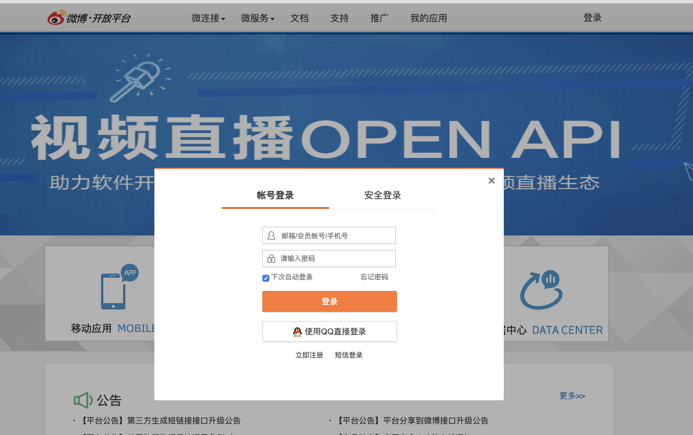
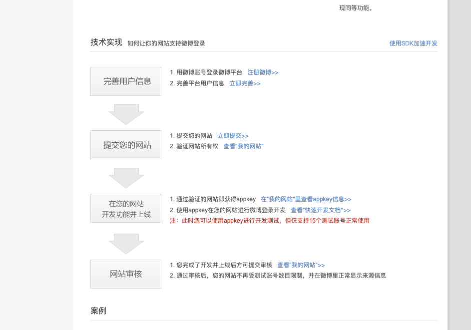
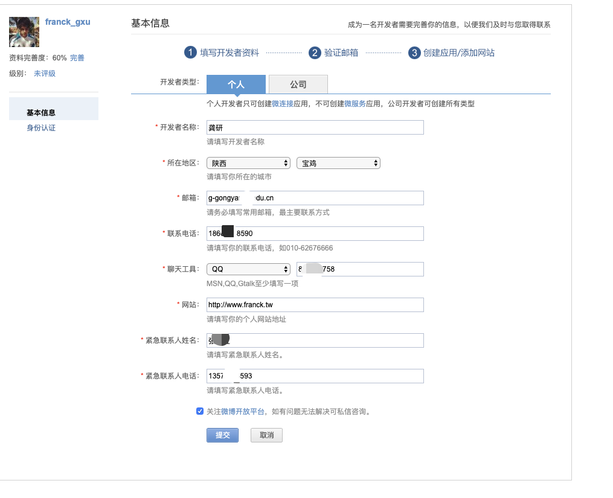
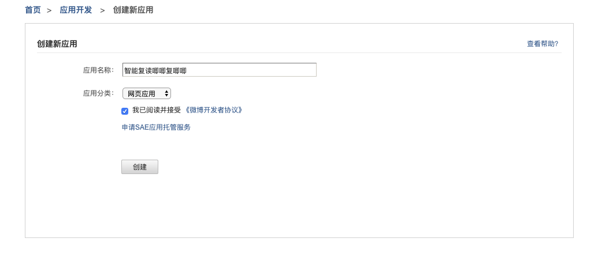
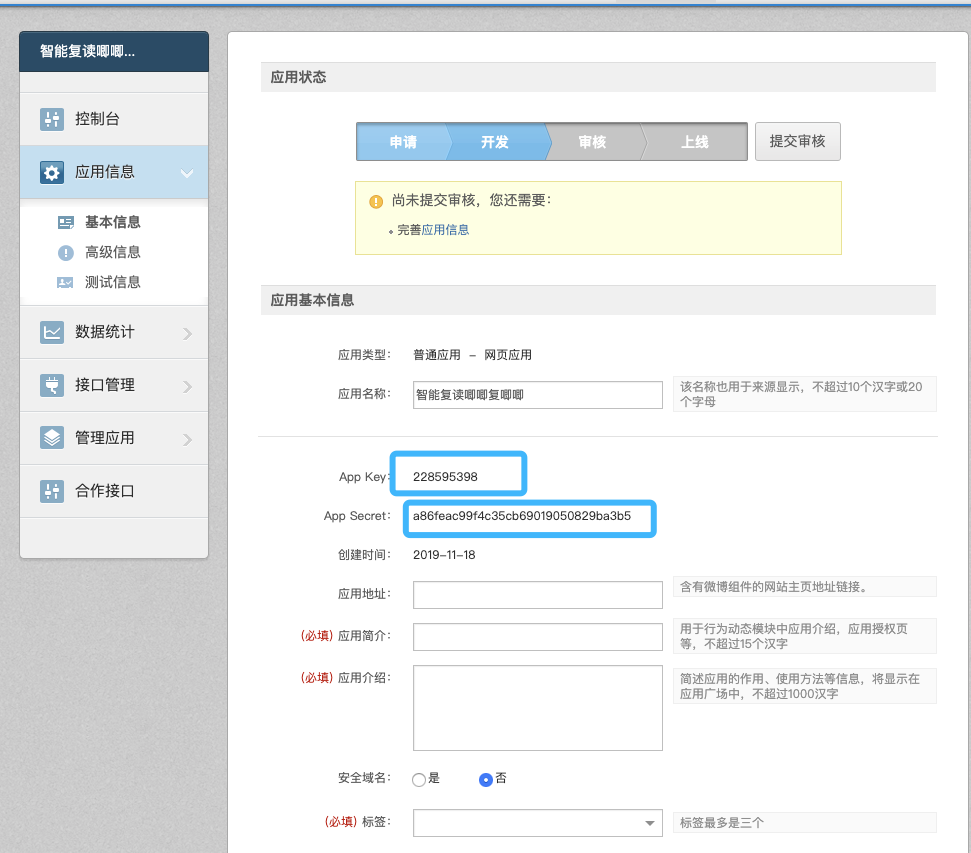
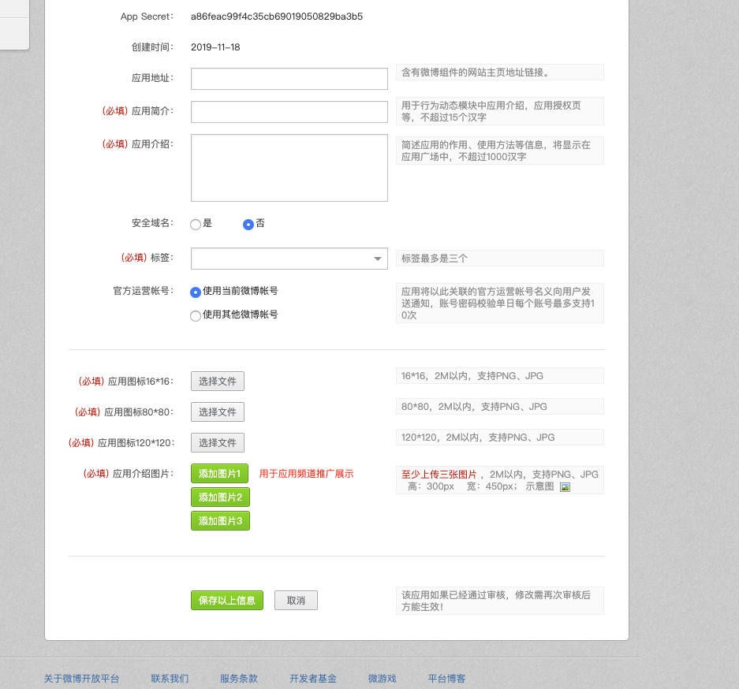
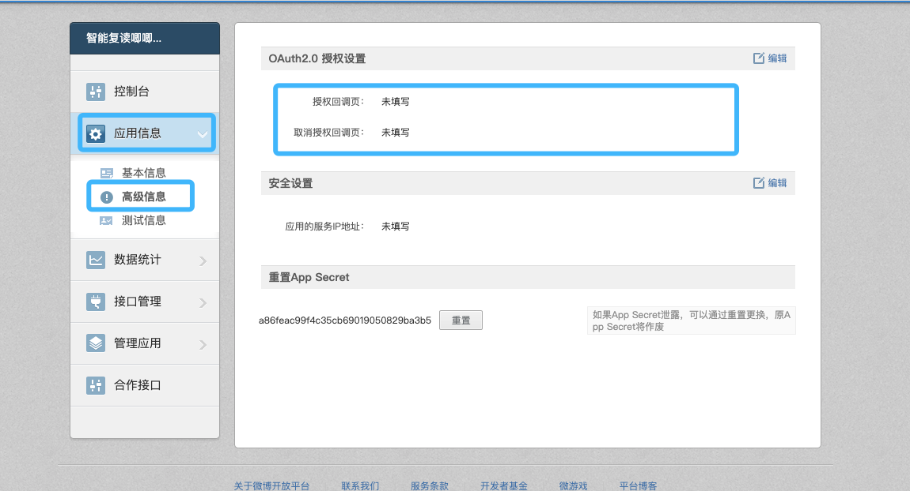
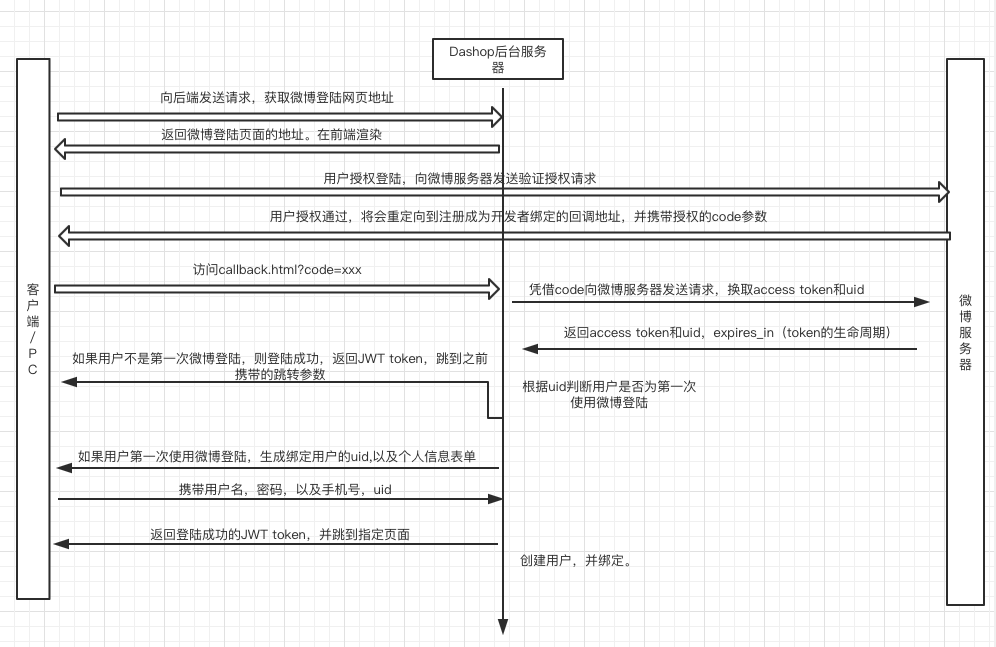
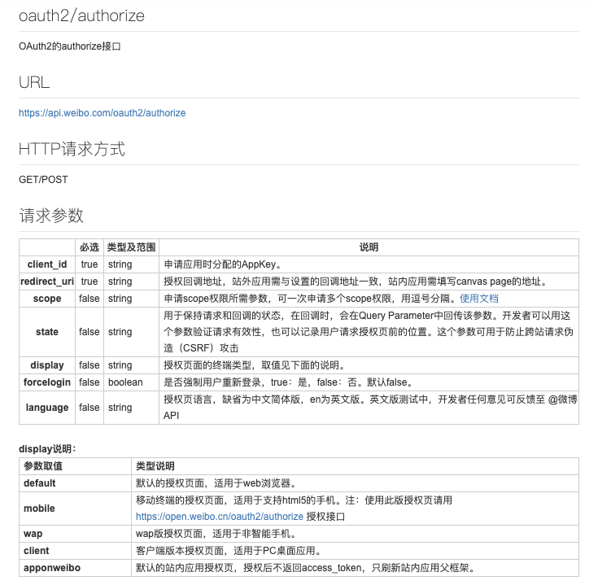
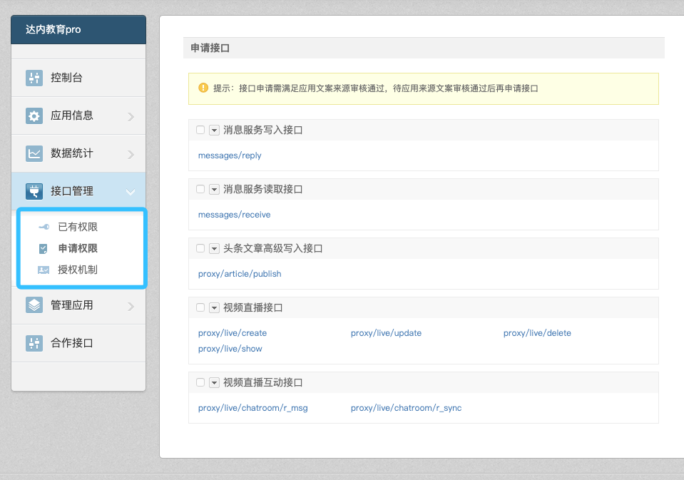

## 微博第三方登录

​		微博开放平台封装了可直接部署在任意网站上的微博登录按钮、关注按钮、分享按钮等组件，为开发者降低新用户注册门槛的同时，实现了社交关系的零成本引入和优质内容的快速传播。

​		微博开发平台地址：http://open.weibo.com 

1.首先要在微博开发着平台去注册成为开发者。一般只要拥有微博账号就可以成为开发者，两者账号是共通的。网页链接为：https://open.weibo.com/#_loginLayer_1570548472921, 在此页进行登陆。



2.登陆之后可以，可以在本页面中看到相关微博登陆实现路线。https://open.weibo.com/authentication



3.此时我们去要先去完善个人信息。完善个人信息网址如下（在此需要注意的是我们个人开发这就直接去选择个人就可以了）：https://open.weibo.com/developers/basicinfo



4.创建个人网站，在此网页中输入你自定义的应用名称，此应用名称也就是用户通过微博授权登陆时，提示的哪个网站将会获取个人信息：https://open.weibo.com/apps/new?sort=web



5.创建之后跳转到个人应用的网页，此网页中会有一些相关信息，例如：应用的key、应用的secret.这两条信息至关重要。应当保存好，可以根据当前页面中的提示进行补充完善个人信息。



6.设置回调地址：此时的回调地址就是微博授权登陆成功之后，前端重定向的地址。在此处设置相关的回调地址：

7.微博登陆时序图。



### step1获取微博登陆页以及用户授权code

我们可以先将一些关键参数配置到settings中。

```python
# 微博第三方登陆的配置信息
# 微博开发者平台注册应用ID
WEIBO_CLIENT_ID = '2987431629'
# 微博开发者平台注册的应用的密钥
WEIBO_CLIENT_SECRET = 'fe3c4fe60da7f2de3413522c1551b7d2'
# 需要在高级应用中配置的正常请求之后的回调地址 回调地址可以自己设置，具体根据回调页面设置
REDIRECT_URI = 'http://127.0.0.1:8080/templates/web/callback.html'
```

获取微博登陆页URL的API：

```python
http://127.0.0.1:8000/v1/users/weibo/authorization
```

请求方式：**GET**

**返回值**：JSON

**响应格式**：

```python
{
  'oauth_url': oauth_weibo_url # 微博登陆页URL，重定向到此页
}
```



后端实现：

```python

# 获取微博登陆页
class OAuthWeiboUrlView(View):
    def get(self, request):
        """
        用来获取微博第三方登陆的url
        :param request:
        :param username:
        :return:
				http://127.0.0.1:8000/v1/users/weibo/authorization
				"""
        try:
            oauth_weibo = OAuthWeibo()
            oauth_weibo_url = oauth_weibo.get_weibo_login()
        except Exception as e:
            return JsonResponse({'code': 10124, 'message': {'message': 'Cant get weibo login page'}})
        print('test')
        return JsonResponse({'code': 200, 'oauth_url': oauth_weibo_url})
      
# weiboapi
class OAuthWeibo(object):

    def __init__(self):
        # 网站应用客户端id
        self.client_id = settings.WEIBO_CLIENT_ID
        # 网站应用客户端安全密钥
        self.client_secret = settings.WEIBO_CLIENT_SECRET
        # 网站回调url网址
        self.redirect_uri = settings.REDIRECT_URI

    def get_weibo_login_code(self):
        """
        用于获取微博登陆的URL
        :return: 微博登陆的网址
        """
        # 参数解释地址：https://open.weibo.com/wiki/Oauth2/authorize
        params = {
            'response_type': 'code', # 固定值为code
            'client_id': self.client_id, # 固定值为应用的id
            'redirect_uri': self.redirect_uri, # 固定值为我们之前设置的回调地址，此关键字参数不能改
            'scope': ''  # 在请求的过程中可以提交相关权限接口，
        }

        # 拼接url地址
        weibo_url = 'https://api.weibo.com/oauth2/authorize?'
        # url = 'client_id=123050457758183&redirect_uri=http://www.example.com/response&response_type=code'
        url = weibo_url + urlencode(params)
        return url
```

前端页面收到重定向的第三方登录，登陆成功之后会携带我们在注册的时候的填写回调地址的网页。

#### scope说明

Scope 相关网页地址为：https://open.weibo.com/wiki/Oauth2/authorize

scope是OAuth2.0授权机制中authorize接口的一个参数。通过scope，平台将开放更多的微博核心功能给开发者，同时也加强用户隐私保护，提升了用户体验，用户在新OAuth2.0授权页中有权利选择赋予应用的功能。

关于scope的解释文档如下，假如我们需要使用更多的微博用户相关的信息，我们可以添加scope这个参数，**scope参数并不是必须的，我们可以通过设置scope的值来获取相关权限**

开发者需要先在应用控制台的接口管理中申请到相关的接口，才能使用scope功能，如果没有接口权限，调用时候会遇到10014错误。相关申请页面如下(在此页面中可以查看已有权限)：



满足上一条后，开发者向用户请求scope权限，就会出现高级授权页面(如下图)，当用户允许后就能正常使用接口，反之会遇到10032错误。

#### redirect_uri:

我们自己在后端设置的地址，和微博开发者平台上的地址必须一致，主要是为了防止返回地址被篡改为其他网站。

### step2:获取用户token

Oauth_weibo_url示例:

Ouath_url 是后端给我们返回的重定向的地址。此地址会在前端冲定向到我们的授权登陆页。用户可以在此页上进行登陆授权。

```python
https://api.weibo.com/oauth2/authorize?response_type=code&client_id=4135484183&redirect_uri=http%3A%2F%2Fwww.dadashop.com%3A8080%2Foauth_callback.html&scope=
```

登陆授权之后会返回我们之前设置的回调地址。也就是上面链接中的。**redirect_uri**是我们在settings中配置的一项。

授权登陆成功之后会回调到我们的前端的地址。地址如下：

```python
# 此处的地址为前端地址
#http://127.0.0.1:8080/callback.html?state=%2F&code=ef0362d563853d93a9b9be95381a165a
```

此链接中的code是个临时码，此code生成的临时的用来获取**access_token**和**uid**.

 access_token:此关键参数可以根据我们自己应用的权限来获取用户的其他相关信息，具体的使用方式可以查看相关的scope中获取的权限。

 uid:微博的用户ID，此值是唯一的。

​	当用户页面重定向到上面的网址时候，js获取到code码，继续向后端发送请求，获取access_token以及获取用户的uid。查询是否绑定的了达达商城的用户，如果绑定返回jwt token,如果没有绑定，返回重定向的页面绑定新用户，然后再返回jwt token.

后端的接口如下：

```python
http://127.0.0.1:8000/v1/user/weibo/users
```

请求方式：**GET**

请求参数：

| 参数 | 参数类型 | 备注 | 含义                     |
| ---- | -------- | ---- | ------------------------ |
| code | char     | 必填 | 用户登陆之后获得的授权码 |

后端的收到GET请求获取到前端传递过来的code参数，凭借code参数向微博服务器发送请求，获取access_token和uid.

后端逻辑：

```python
class OAuthWeiboView(View):
    def get(self, request):
        """
        获取用户的code，换取token
        """
        # 首先获取两个参数code 和state
        code = request.GET.get('code', None)
        # TODO 校验code
        try:
            oauth_weibo = OAuthWeibo()
        except Exception as e:
            return JsonResponse({'code': 10125, 'error': {'message': 'Unable to get weibo token'}})
        # 返回用户的绑定信息 data格式如下
        """
        data = {
            # 用户令牌，可以使用此作为用户的凭证
            "access_token": "2.00aJsRWFn2EsVE440573fbeaF8vtaE",
            "remind_in": "157679999",             # 过期时间
            "expires_in": 157679999,
            "uid": "5057766658",
            "isRealName": "true"
        }
        """
        userInfo = oauth_weibo.get_access_token_uid(code)
        # 将用户weibo的uid传入到前端
        weibo_uid = userInfo_dict.get('uid')
        try:
            weibo_user = WeiboUser.objects.get(uid=weibo_uid)
        except Exception as e:
            # 如果查不到相关的token 则说明没用绑定相关的用户
            # 没有绑定微博用户则说明用户表中也没有创建用户信息。此时返回access_token,
            # 并且让跳转到 绑定用户的页面，填充用户信息，提交 绑定微博信息
            data = {
                'code': '201',
                'uid': weibo_uid 
            }
            return JsonResponse(data)
        else:
            # 如果查询到相关用户绑定的uid
            # 此时正常登陆。然后返回jwt_token
            user_id = weibo_user.uid
            str_user_id = str(user_id)
            try:
                user = UserProfile.objects.get(id=int(str_user_id))
            except Exception as e:
                return JsonResponse({'code':10134,'error':{'message':'Cant get User'}})
            username = user.username
            token = make_token(username)
            result = {'code': 200, 'username': username, 'data': {'token': token.decode()}}
            return JsonResponse(result)
```

返回值**：JSON

**响应格式**：

```python
# 未查询到绑定用户
{
  'code':'201',
  'uid':uid
}

# 查询到绑定用户
{
  'code': '200',
  'username': 'xxxxxx',
  'data': {
    'token': token.decode()
  }
}
```

如果返回的是201.此时前端页面会出现绑定用户的信息的表单，通过表单提交用户信息以及微博用户的uid。此时完成本站用户信息和微博用户的绑定。

**请求方法**：POST

**请求参数**：JSON

| 参数     | 含义       | 参数类型 | 备注 |
| -------- | ---------- | -------- | ---- |
| uid      | 用户微博id | char     | 必填 |
| username | 用户名     | char(10) | 必填 |
| password | 密码       | char(10) | 必填 |
| phone    | 电话       | char(20) | 必填 |
| email    | 邮箱       | char(10) | 必填 |

  示例：

```json
{
  'uid':'1234567891',
  'username':'jack_ma',
  'password':'1234567',
  'phone':'18667018590',
  'email':'842549758@qq.com'
}
```

响应示例：

```python
# 正常响应：
{
  ‘code’:200,
  'username':'jack_ma',
  'data':{
    'token':"tfjkdsaljfioaywetoigsfadfdsafawertew"
  }
}
# 异常响应：
{
  'code':xxx,
  'error':{
  'message':'error_reason'
	}
}
```

后端逻辑：

```python
 def post(self, request):
        """
        此时用户提交了关于个人信息以及uid
        创建用户，并且创建绑定微博关系
        :param requset:
        :return:
        """
        data = json.loads(request.body)
        # TODO 获取用户提交表单数据--校验用户提交表单中的信息
        #  TODO 对商品进行散列存储
        # 创建用户以及微博用户表
        try:
            with transaction.Atomic(using=None, savepoint=True):
                UserProfile.objects.create(username=username, password=m.hexdigest(),
                                       email=email, phone=phone)
                user = UserProfile.objects.get(username=username) 
               	user.uid = uid
                user.save()
        except Exception as e:
            print(e)
            return JsonResponse({'code': 10128, 'error': {'message': 'create user failed!'}})
        # 创建成功返回用户信息
        # TODO 生成token 返回token
        return JsonResponse(result)
```


